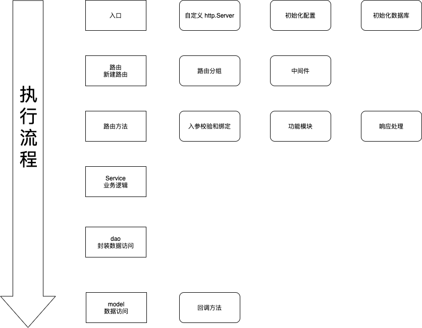

# api-service
## api-service 开发流程
1. 创建一级目录
2. go mod init 初始化
3. go get 安装 gin
4. 自定义 http.Server
5. 新建路由函数
6. go get 安装 viper
7. 入参校验和绑定
8. 响应处理
9. go get 安装 gorm
10. 数据库连接
11. 功能模块开发（model方法，model 回调，dao 方法，service 方法，路由方法）
12. 错误码，日志写入

## 程序执行流程图
